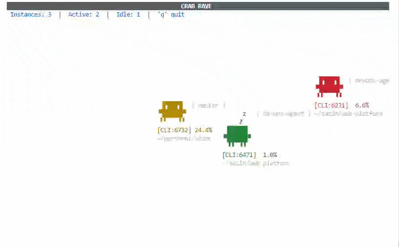

# Crab Rave! For Claude Code

A terminal-based process monitor for Claude Code instances. Each running instance gets its own animated crab — active ones walk around, idle ones sleep.



## Setup

One file, zero dependencies. Just needs Python 3.11+ and Linux.

```bash
# Download
curl -O https://raw.githubusercontent.com/YOUR_USER/YOUR_REPO/main/crab.py
chmod +x crab.py

# Run
python3 crab.py
```

Or clone and run directly:

```bash
git clone https://github.com/YOUR_USER/YOUR_REPO.git
cd YOUR_REPO
./crab.py
```

## How it works

The script scans `/proc` every 3 seconds looking for Claude Code processes (CLI, VS Code extension, and runner instances). For each one it finds, a crab appears on screen:

- **Walking crab** — Claude instance using >5% CPU (actively working)
- **Sleeping crab** — Claude instance idle or below 5% CPU

Each crab displays:

- Its **process type** (`CLI`, `VS`, `RUNNER`) and PID
- Current **CPU usage** percentage
- The **git branch** it's working on
- Its **working directory**

Press `q` or `Esc` to quit.

## Configuration

Everything is a constant at the top of `crab.py` — edit to taste:

```python
CPU_THRESHOLD = 5.0    # Min CPU% to count as "active" (walking)
SCAN_INTERVAL = 3.0    # Seconds between /proc scans
FRAME_INTERVAL = 0.1   # Animation speed (~10 FPS)
```

## Requirements

- **Python 3.11+** (uses `X | Y` union syntax)
- **Linux** (reads `/proc` filesystem — macOS supporting coming soon)
- A terminal that supports Unicode block characters
